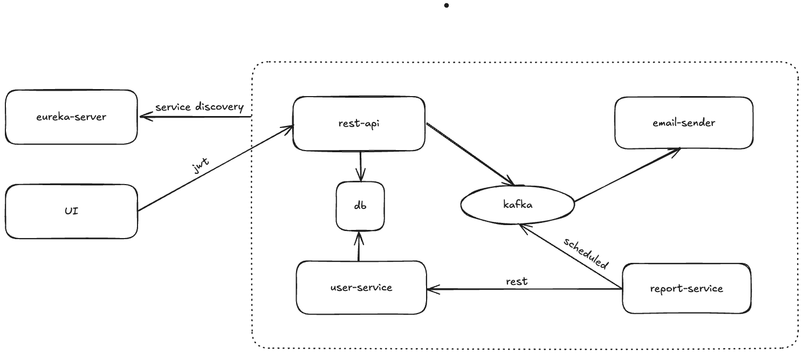

# Task Tracker

**Task Tracker** is a multi-user service designed for task management. Key features include:

- Tracking task progress.
- User authorization for secure access.
- Scheduled email reports on pending tasks.

This service is built to simplify project management and boost team productivity.

